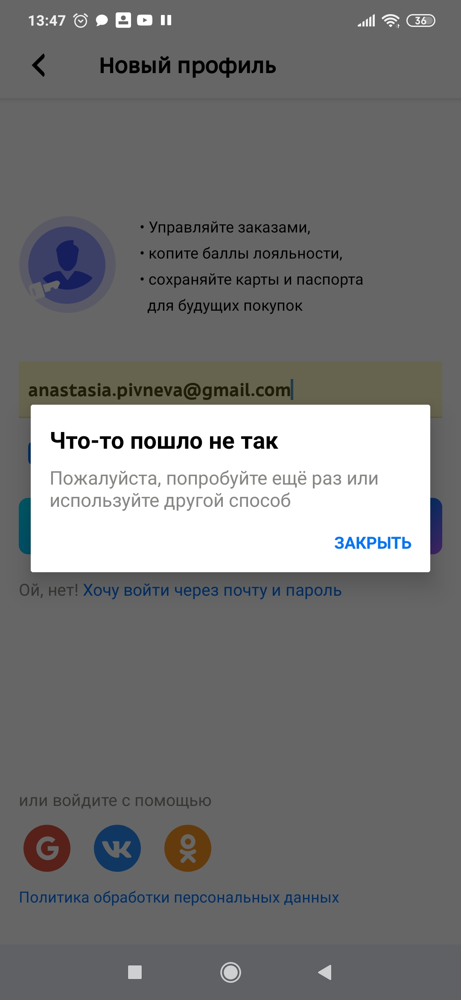

 ### Отчет о тестировании нативного приложения tutu 

 на мобильном устройстве Redmi Note 8 Pro, версия Android 9

| ID  | Наименование | Приоритет   | Результат |
| ------------- | ------------- | ---------------|---------------|
|   4   |    Выбор города отправления  | Средний     |  Пройден |
|   5  |  Выбор города прибытия  | Средний  | Пройден  |
|  6 |  Выбор даты прибытия |  Средний  | Пройден  |
 7 | Выбор даты отправления  |   Средний  | Пройден  |
| 8   | Выбор количества пассажиров  | Средний  | Пройден   | 
 9 | Выбрать билеты в одну сторону  |  Средний  | Пройден |
 11|Выбор обложки |Средний  | Пройден |
 12| Поменять местами город отправления и город прибытия|Средний  | Пройден |
 13|Прочитать правила возврата и обмена билетов|Средний  | Пройден |
 14| Прочитать ответы на частые вопросы "Авиабилеты" |Средний  | Пройден |
 15| Прочитать ответы на частые вопросы "Поезда"| Средний  | Пройден |
 16| Прочитать ответы на частые вопросы "Автобусы"|Средний  | Пройден |
 17| Информация о границах и ограничениях |Средний  | Пройден |
 18 |Авторизация зарегистрированного пользователя |Средний  | Пройден |
 19| Авторизация зарегистрированного пользователя + пустой пароль| Средний  | Пройден |
 20| Авторизация зарегистрированного пользователя + пустой email|Средний  | Пройден |
 21| Авторизация "Быстрый вход без пароля"|Средний  | Пройден |
 22| Авторизация "Быстрый вход без пароля" + пустой email|Средний  | Пройден |
 23| Авторизация "Быстрый вход без пароля" + невалидный код |Средний  | Пройден |
 24| Регистрация нового пользователя |Средний  | `Провален` |
 25| Регистрация нового пользователя + пустой email|Средний  | Пройден |
 26| Восстановление пароля |Средний  | Пройден |
 27| Восстановление пароля + невалидный код  |Средний  | Пройден |
 28| Поменять язык приложения на английский|Средний  | Пройден |
 29 | Бронирование билетов|Средний  | Пройден |
 30| Посмотреть историю заказов |Средний  | Пройден |
 31|Данные пассажиров| Средний  | Пройден |
 32| Отзыв о приложении с ответом |Средний  | Пройден |
 33| Информация о доступных направлениях |Средний  | Пройден |
 34| Выбрать билеты + нет интернета| Средний  | Пройден |
 35| Выбрать билеты в обе стороны | Средний  | Пройден |
 36| Просмотреть уведомления|Средний  | Пройден |
 37| Выбрать билеты + входящий звонок|Средний  | Пройден |
 38| Выбрать билеты + входящее оповещение из другого мобильного приложения |Средний  | Пройден |
 39| Выбрать билеты + низкий заряд батареи| Средний  | Пройден |
 40| Выбрать билеты + подключен для зарядки|Средний  | Пройден |
 |

## Баг-репорт №1. Нет возможности авторизоваться, через ссылку "Зарегистрируйтесь, это легко"

Предшествующие условия:

Установлено приложение tutu на мобильном телефоне на платформе Android

Шаги:

1. Проскроллить вниз страницы
2. Нажать на кнопку "Войти"
3. Нажать "Зарегистрируйтесь, это легко"
4. Ввести электронную почту
5. Поставить галочку "Даю согласие на обработку персональных данных"
6. Нажать поле "Создать профиль"

Ожидаемый результат: Пользователь зарегистрирован
Фактический результат: Пользователь не зарегистрирован. Вышло сообщение: "Что-то пошло не так. Пожалуйста, попробуйте еще раз или используйте другой способ.

Окружение: Модель устройства Redmi Note 8 Pro, версия Android 9PPR1.180610.011

Priority: major

Вложение: скрин 1

