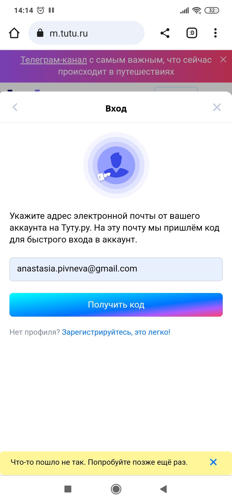

 ### Отчет о тестировании `web` приложения tutu 

 на мобильном устройстве Redmi Note 8 Pro, версия Android 9

| ID  | Наименование | Приоритет   | Результат |
| ------------- | ------------- | ---------------|---------------|
|   4   |    Выбор города отправления  | Средний     | Пропущен |
|   5  |  Выбор города прибытия  | Средний  | Пропущен  |
|  6 |  Выбор даты прибытия |  Средний  | Пропущен  |
 7 | Выбор даты отправления  |   Средний  | Пропущен  |
| 8   | Выбор количества пассажиров  | Средний  | Пропущен   | 
 9 | Выбрать билеты в одну сторону  |  Средний  | Пропущен |
 11|Выбор обложки |Средний  | Пропущен |
 12| Поменять местами город отправления и город прибытия|Средний  | Пропущен |
 13|Прочитать правила возврата и обмена билетов|Средний  | Пропущен |
 14| Прочитать ответы на частые вопросы "Авиабилеты" |Средний  | Пропущен |
 15| Прочитать ответы на частые вопросы "Поезда"| Средний  | Пропущен |
 16| Прочитать ответы на частые вопросы "Автобусы"|Средний  | Пропущен|
 17| Информация о границах и ограничениях |Средний  | Пропущен |
 18 |Авторизация зарегистрированного пользователя |Средний  | `Провален` |
 19| Авторизация зарегистрированного пользователя + пустой пароль| Средний  | Пройден |
 20| Авторизация зарегистрированного пользователя + пустой email|Средний  | Пройден |
 21| Авторизация "Быстрый вход без пароля"|Средний  | `Провален`  |
 22| Авторизация "Быстрый вход без пароля" + пустой email|Средний  | Пройден |
 23| Авторизация "Быстрый вход без пароля" + невалидный код |Средний  | `Провален` |
 24| Регистрация нового пользователя |Средний  | `Провален` |
 25| Регистрация нового пользователя + пустой email|Средний  | Пройден |
 26| Восстановление пароля |Средний  | `Провален` |
 27| Восстановление пароля + невалидный код  |Средний  | `Провален`  |
 28| Поменять язык приложения на английский|Средний  |  |
 29 | Бронирование билетов|Средний  | Пропущен |
 30| Посмотреть историю заказов |Средний  | Пропущен |
 31|Данные пассажиров| Средний  | Пропущен |
 32| Отзыв о приложении с ответом |Средний  | Пропущен |
 33| Информация о доступных направлениях |Средний  | Пройден |
 34| Выбрать билеты + нет интернета| Средний  | Пройден |
 35| Выбрать билеты в обе стороны | Средний  | Пройден |
 36| Просмотреть уведомления|Средний  | Пропущен |
 37| Выбрать билеты + входящий звонок|Средний  | Пройден |
 38| Выбрать билеты + входящее оповещение из другого мобильного приложения |Средний  | Пройден |
 39| Выбрать билеты + низкий заряд батареи| Средний  | Пройден |
 40| Выбрать билеты + подключен для зарядки|Средний  | Пройден |
 |

## Баг-репорт №2. Нет возможности авторизоваться, через "Быстрый вход без пароля"

Предшествующие условия:

Открыто web приложение tutu на мобильном телефоне на платформе Android

Шаги:

1. Проскроллить вниз страницы
2. Нажать на кнопку "Войти"
3. Нажать "Быстрый вход без пароля"
4. Укажите электронный адрес
5. Нажать на кнопку "Получить код"
6. Ввести код и нажать кнопку "Войти"

Ожидаемый результат: Пользователь зарегистрирован
Фактический результат: Пользователь не зарегистрирован. Вышло сообщение: "Что-то пошло не так. Попробуйте еще раз.

Окружение: Модель устройства Redmi Note 8 Pro, версия Android 9PPR1.180610.011
Браузер Google Chrome 114.0.5735.196

Priority: major

Вложение: скрин 2

## Баг-репорт №3. Нет возможности авторизоваться, через ссылку "Зарегистрируйтесь, это легко"

Предшествующие условия:

Открыто web приложение tutu на мобильном телефоне на платформе Android

Шаги:

1. Проскроллить вниз страницы
2. Нажать на кнопку "Войти"
3. Нажать "Зарегистрируйтесь, это легко"
4. Ввести электронную почту
5. Поставить галочку "Даю согласие на обработку персональных данных"
6. Нажать поле "Создать профиль"

Ожидаемый результат: Пользователь зарегистрирован
Фактический результат: Пользователь не зарегистрирован. Вышло сообщение: "Что-то пошло не так. Попробуйте позже еще раз.

Окружение: Модель устройства Redmi Note 8 Pro, версия Android 9PPR1.180610.011
Браузер Google Chrome 114.0.5735.196

Priority: major

Вложение: скрин 3

## Баг-репорт №4. Нет восстановления пароля

Предшествующие условия:

Открыто web приложение tutu на мобильном телефоне на платформе Android

Шаги:

1. Проскроллить вниз страницы
2. Нажать на кнопку "Войти"
3. Нажать на поле "Не помню пароль"
4. Ввести адрес электронной почты
5. Нажать на поле "Получить код"
6. Ввести 4-х значный пароль и нажать "Войти"

Ожидаемый результат: Пользователь получил код для авторизации на электронную почту и авторизовался.
Фактический результат: Пользователь не получил код для авторизации на электронную почту и не авторизовался. Вышло сообщение: "Что-то пошло не так. Попробуйте позже еще раз.

Окружение: Модель устройства Redmi Note 8 Pro, версия Android 9PPR1.180610.011
Браузер Google Chrome 114.0.5735.196

Priority: major

Вложение: скрин 4

## Баг-репорт №5. Нет возможности авторизоваться через валидную электронную почту и пароль

Предшествующие условия:

Открыто web приложение tutu на мобильном телефоне на платформе Android

Шаги:

1. Нажать на кнопку "Войти"
2. Ввести адрес электронной почты
3. Ввести пароль
4. Нажать на кнопку "Войти"

Ожидаемый результат: Пользователь авторизован
Фактический результат: Пользователь не авторизован. Вышло сообщение: "Что-то пошло не так. Попробуйте позже еще раз.

Окружение: Модель устройства Redmi Note 8 Pro, версия Android 9PPR1.180610.011
Браузер Google Chrome 114.0.5735.196

Priority: major

Вложение: скрин 5

