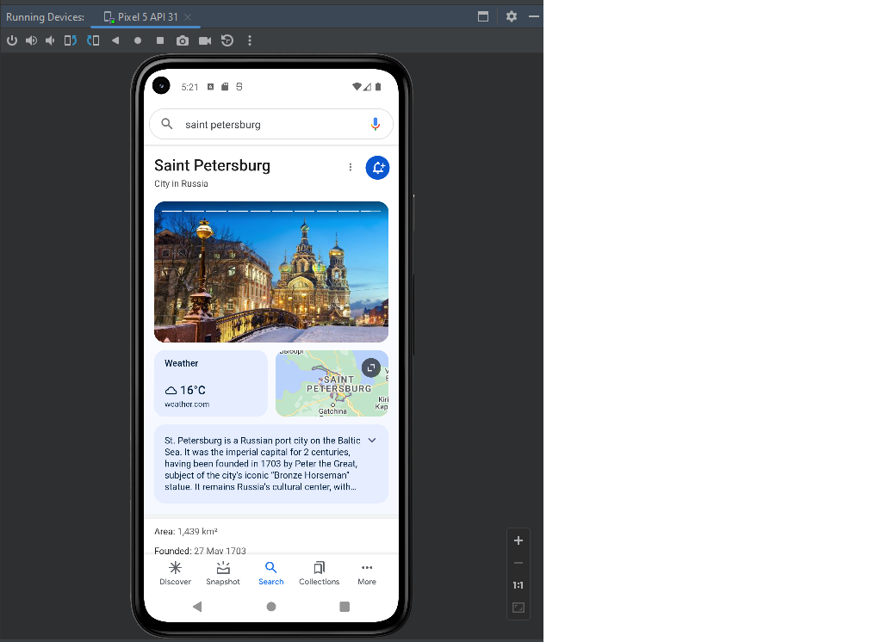

## Возможности "Your Virtual Device" в Android Studio

`Android Studio` - быстрый эмулятор смартфонов от Google позволяет запускать на компьютере последние версии операционной системы Android и тестировать необходимые вам приложения.

Эмулятор может имитировать работу смартфона, планшета, часов Wear OS и устройств Android TV.

Этот эмулятор смартфонов можно использовать для тестирования разнообразных приложений и последних версий операционных систем Android. И пригодится на тот случай, если у вас нет подходящего телефона или планшета. Также не стоит забывать о сумасшедшей фрагментации мира Андроидов, а ведь это сотни различных чипов, разрешений и дизайнов. Нельзя скупить тысячи устройств и на всех протестировать ПО. 

Для создания проекта нужно указать его название, язык программирования и т.д.
Если нужно будет изменить настройки AVD (Android Virtual Device)), это легко можно сделать, нажав на кнопку Edit рядом с нужным эмулятором в списке Менеджера AVD.

`Работа с SDK-менеджером`

Хотя Android Studio включает в себя уйму инструментов, в нем отсутствует весомый кусок часто используемых компонентов. Их надо загрузить отдельно, через SDK-менеджер. Он расположен в том же меню, что и AVD-менеджер – во вкладке `Tools` на панели инструментов Android Studio. 

SDK Manager позволяет загрузить утилиты, необходимые при создании программ для очков Google Glass или для добавления специфичных возможностей в приложение для телефона, которые недоступны в AS в базовой комплектации. 

Мною была создана версия Pixel 5 API 31 Android 12,0 х86_64.

Чтобы имитировать палец, мы используем указатель мыши компьютера, на сенсорном экране, выбираем пункты меню и поля ввода, а также кнопки и элементы управления. 

Есть возможность имитировать телефонные звонки и сообщения, указывать местоположение, имитировать вращение и другие аппаратные датчики, получать доступ к Google Play.

Мною были прослушаны видео с канала YouTube. Поле самого симулятора можно увеличить, чтобы было удобнее с ним работать.

Чтобы установить приложения, необходимо авторизоваться. Доступны сайты с vpn включением, например. Instagram.

Для поиска в коде, нужно дважды нажать кноку Shift или щелкнуть увеличительное стекло в правом верхнем углу. 

Эмулятор Android позволяет тестировать самые разные функции. Их можно настроить, нажав на кнопку `Extended Controls` (значок три вертикальных точки), можно выбрать Location, displays, battery, microphone и т.д. Вкладка Cellular содержит параметры, регулирующие качество связи и мобильного интернета. Например, можно настроить тип сети, выбрав LTE, GPRS или другие варианты, силу сигнала и домашний регион/роуминг.

На панеле инструментов, есть следующие возможности, изображенные значками:

- Кнопка включания/выключения экрана. При удерживании включает/выключает устройство.
- Кнопка увеличения громкости
- Кнопка уменьшения громкости
- Поворот экрана  налево
- Поворот экрана направо
- Создание скриншота экрана. По умолчанию, скриншот сохраняется на рабочий стол и имеет название Screenshot_yyyymmdd-hhmmss.png.
- Возвращает к предыдущему экрану либо закрывает диалоговое окно, меню опций, панель уведомлений или экранную клавиатуру.
- Возвращает на домашний экран.
- Открывает список недавних приложений.

`Ограничения`

Эмулятор Android не включает виртуальное оборудование для следующих целей:

- Блютуз
- NFC
- Вставка/извлечение SD-карты
- Наушники, подключенные к устройству
- USB-порт

`Примечание`: образы x86 работают на эмуляторе быстрее всего.

`Особенности`: Необходимо обеспечить возможность виртуализации, иначе не получится создать проект. Такая возможность может поддерживаться системой, но по умолчанию она отключена.

Главным преимуществом эмулятора при тестировании является то, что он даёт мгновенный доступ к любой версии Android или любому устройству, на котором нужно проверить работу приложения. Кроме того, разработчику не нужно волноваться по поводу того, что эмулятор перестанет корректно работать — в этом случае достаточно будет просто сбросить его до базовых параметров.
